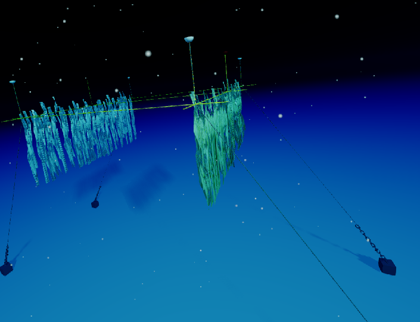
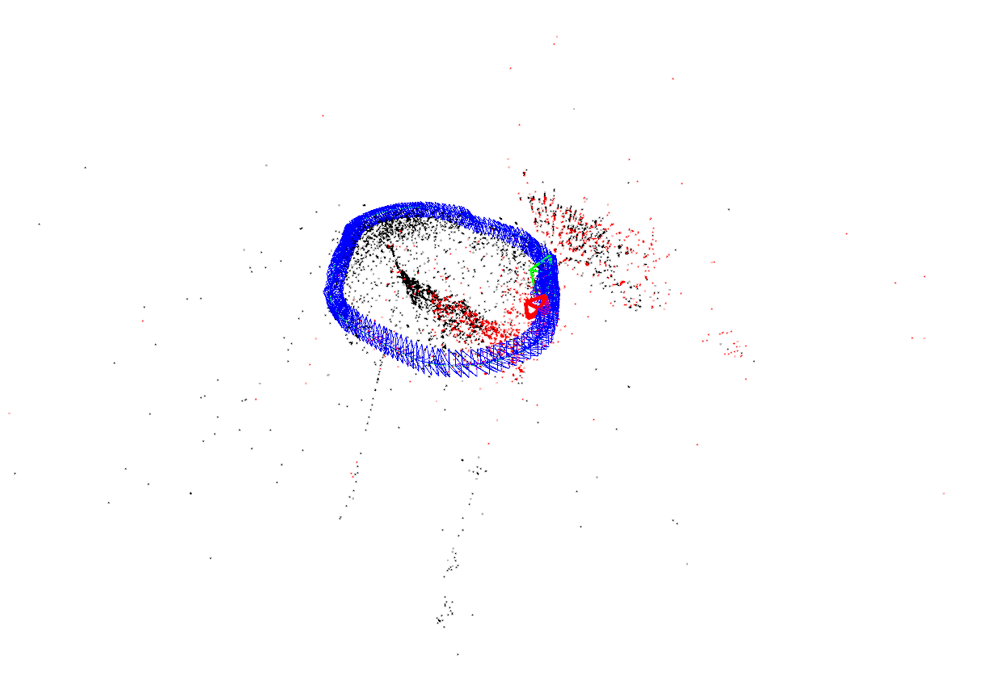

# orb_slam3_ros_tube ROS Package
This is a middle tube between ORB-SLAM-3 and ROS

## To-do
- [x] Develop Monocular only node for VO
- [x] Develop Monocular + IMU node for VIO (debugging)
- [x] Write launch files for each node and dataset
- [x] Develop ROS publishers for pose, velocity, pointcloud and path
- [x] Create .yaml file for the camera param, IMU param and ORB hyperparam for SAM
- [ ] Develop two-camera + IMU fusion mode
- [x] Fine-tuning the hyperparam for SAM


# Installation
## 1. Install ORB-SLAM3
- Install the [prerequisites](https://github.com/UZ-SLAMLab/ORB_SLAM3#2-prerequisites).
- Use cmake combo to install ORB-SLAM-3 source code
```
cd ~
git clone https://github.com/UZ-SLAMLab/ORB_SLAM3.git ORB_SLAM3
cd ORB_SLAM3
chmod +x build.sh
./build.sh
```


## 2. Install orb_slam3_ros_tube ROS Package
Clone the package. Note that it should be a `catkin build` workspace.
```
cd ~/catkin_ws/src/ # Or the name of your workspace
git clone https://github.com/OatmealLiu/orb_slam3_ros_tube.git
```
Build the package normally.
```
cd ~/catkin_ws/
catkin build
```

# Run and Outputs
## 1. Run with different datasets and mode
EuRoC dataset
- VO
```
# Terminal 1
roslaunch orb_slam3_ros_tube orb_slam3_mono_euroc.launch
# Terminal 2
rosbag play MH_01_easy.bag
```
- VIO
```
# Terminal 1
roslaunch orb_slam3_ros_tube orb_slam3_mono_inertial_euroc.launch
# Terminal 2
rosbag play MH_01_easy.bag
```

Underwater dataset
- VO
```
# Terminal 1
roslaunch orb_slam3_ros_tube orb_slam3_mono_underwater.launch
# Terminal 2
rosbag play sparus_camera.bag
```

SAM Simulator dataset
- VO
```
# Terminal 1
roslaunch orb_slam3_ros_tube sam_simulator_mono.launch
# Terminal 2
rosbag play sam_side_cruise.bag
```

[comment]: <> (![Image text]&#40;https://github.com/OatmealLiu/orb_slam3_ros_tube/blob/master/figures/fig1.png&#41;)

[comment]: <> (![Image text]&#40;https://github.com/OatmealLiu/orb_slam3_ros_tube/blob/master/figures/fig2.png&#41;)




## 2. Topics you can subscribe
This middle tube will provide you with the following topics that you can subscribe:
- [x] `/orb_slam3_ros/camera`: geometry_msgs/PoseStamped Message, where you can find the estimated pose of the robot.
- [x] `/orb_slam3_ros/camera_odom`: nav_msgs/Odometry Message, where you can find the pose, linear velocity and angular velocity of the robot
- [x] `tf`: transformation from the camera frame to the world frame.
- [x] `/orb_slam3_ros/map_points`: sensor_msgs/PointCloud2 Message, where you can find the keypoints are being tracked.
